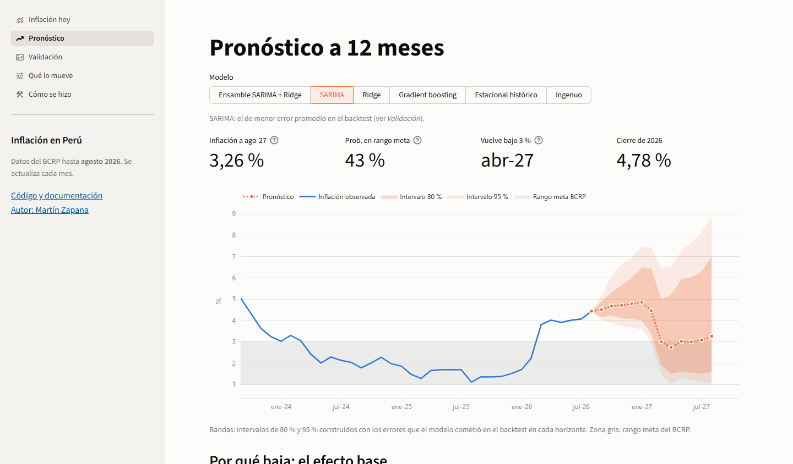
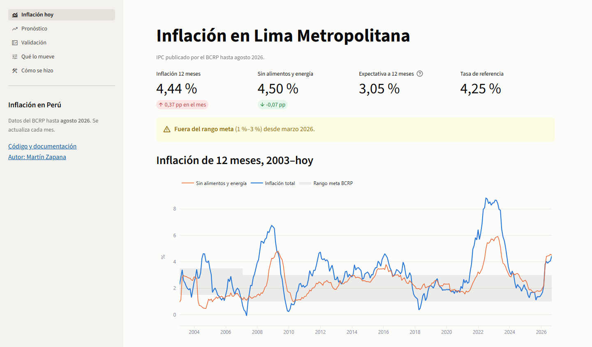
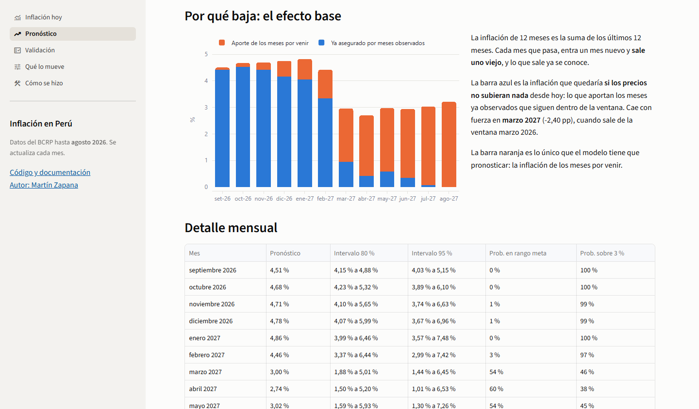
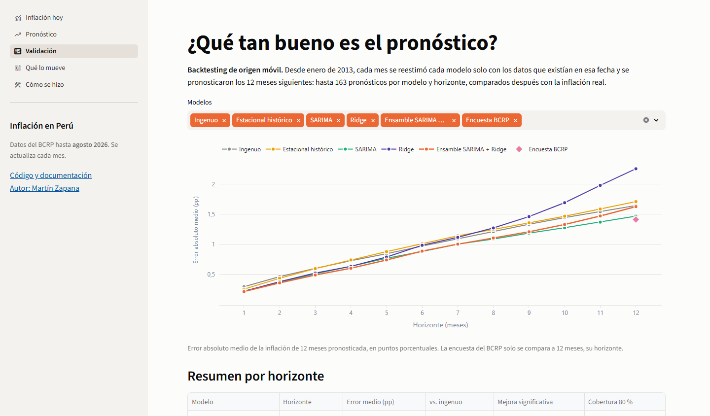
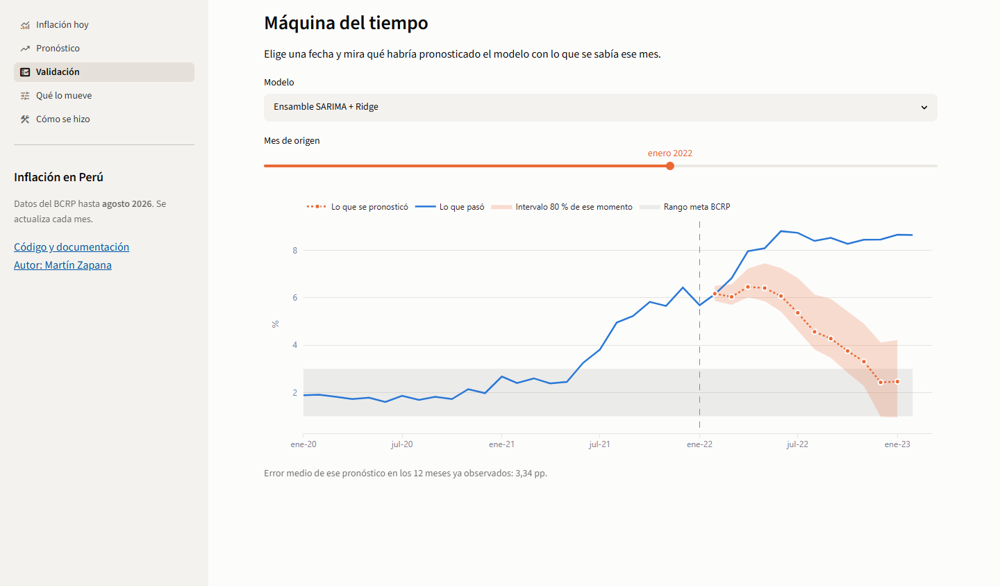

# Pronóstico de inflación en Perú

[](https://github.com/MartinZapanaBerrospi/bcrp-inflation-forecast/actions/workflows/ci.yml)
[](https://bcrp-inflation-forecast.streamlit.app)
[](https://estadisticas.bcrp.gob.pe/estadisticas/series/)
[](src/)
[](LICENSE)

Pronóstico de la **inflación de Lima Metropolitana a 12 meses** con datos públicos del Banco
Central de Reserva del Perú: desde la descarga de 13 series oficiales hasta una
[app en Streamlit](https://bcrp-inflation-forecast.streamlit.app) que se actualiza sola cada mes.
El proyecto compara modelos estadísticos y de machine learning contra referencias simples y contra
la encuesta de expectativas del propio BCRP, con backtesting honesto e intervalos de confianza.



## La pregunta

La inflación pasó de 1,11 % en agosto de 2025 a **4,44 % en agosto de 2026**, fuera del rango meta
del BCRP (1 %–3 %), después de que el IPC subiera **2,38 % solo en marzo de 2026**, el mayor salto
mensual desde 2003.

¿Qué inflación cabe esperar hasta agosto de 2027, cuándo volvería al rango meta y con qué
probabilidad? ¿Un modelo lo pronostica mejor que suponer que la inflación se queda donde está, o que
la expectativa de los propios analistas?

## Hallazgos (datos hasta agosto de 2026)

1. **La inflación bajaría a 3 % en marzo de 2027 por efecto base.** Hasta febrero de 2027 seguiría
   en 4,5–4,9 %. En marzo sale de la ventana de 12 meses el 2,38 % de marzo de 2026: solo por eso,
   la inflación "asegurada" por los meses ya observados cae 2,40 pp en un mes.
2. **A agosto de 2027, el pronóstico es 3,26 %**, con 43 % de probabilidad de estar dentro del
   rango meta y 55 % de estar por encima (SARIMA). La encuesta del BCRP espera 3,05 %.
3. **El mejor modelo es el más simple.** Un SARIMA sobre la variación mensual tiene el menor error
   promedio (0,90 pp). La regresión Ridge y el gradient boosting, con 26 variables y pocos datos,
   rinden peor que el pronóstico ingenuo en promedio.
4. **Solo el corto plazo se puede pronosticar mejor que el ingenuo.** La mejora es significativa
   (Diebold-Mariano, 5 %) a 1 mes para todos los modelos y a 3 meses para el ensamble. A 6 meses o
   más, ningún modelo ni la encuesta es significativamente mejor que suponer que la inflación no
   cambia.
5. **A 12 meses, la encuesta de expectativas del BCRP le gana a todos los modelos** (1,41 pp de
   error frente a 1,47 del SARIMA).
6. **La incertidumbre depende del régimen.** Los intervalos de 80 % cubrieron 75–87 % de los casos a
   1–6 meses en 2013–2019, pero se quedaron cortos en la pandemia y en el choque de 2022, cuando
   ningún modelo anticipó una inflación de 8,81 %. Por eso el pronóstico vigente usa intervalos
   anchos, construidos con todos los errores del pasado.

## La app

**[bcrp-inflation-forecast.streamlit.app](https://bcrp-inflation-forecast.streamlit.app)** — cinco
páginas, una por pregunta:

| | |
|---|---|
|  **Inflación hoy.** Inflación total y sin alimentos y energía desde 2003 sobre el rango meta. |  **Pronóstico · efecto base.** Cuánta inflación ya está "asegurada" por los meses observados y cuánta depende de los meses por venir. |
|  **Validación.** Error por horizonte de 6 modelos y referencias, con su prueba de significancia y la cobertura de los intervalos. |  **Máquina del tiempo.** Qué habría pronosticado cada modelo en cualquier mes desde 2015, frente a lo que pasó. |

La página [Qué lo mueve](docs/img/06_que_lo_mueve.png) descompone el pronóstico de la Ridge en el
aporte de cada variable: hoy lo empuja hacia arriba la subida del trigo (+49 % en 12 meses) y hacia
abajo la apreciación del sol.

## Cómo se construyó

| Fase | Qué se hizo | Documento |
|---|---|---|
| 0. Definición | Pregunta, usuario, métricas de éxito y verificación de las 13 series | [00_definicion.md](docs/00_definicion.md) |
| 1. Adquisición | Descarga de BCRPData con manifiesto y hash SHA-256 | [01_adquisicion.md](docs/01_adquisicion.md) |
| 2. Calidad | 8 reglas, entre ellas reconstruir la inflación publicada desde el índice (diferencia 0,000000 pp) | [02_calidad.md](docs/02_calidad.md) |
| 3. Variables | La inflación de 12 meses separada en efecto base (conocido) y meses por venir (a pronosticar) | [03_variables.md](docs/03_variables.md) |
| 4. Modelos | 3 referencias y 4 modelos; orden del SARIMA elegido por AIC sin mirar el periodo de prueba | [04_modelos.md](docs/04_modelos.md) |
| 5. Evaluación | Backtest de 164 orígenes × 12 horizontes, Diebold-Mariano, intervalos conformales | [05_evaluacion.md](docs/05_evaluacion.md) |
| 6. App | Streamlit con textos que se arman con los datos | [06_app.md](docs/06_app.md) |
| 7. Hallazgos | Arriba | este README |
| 8. Automatización | 23 pruebas en CI y actualización mensual automática de datos, modelos y app | [08_automatizacion.md](docs/08_automatizacion.md) |

**Qué garantiza que el backtest sea honesto.**
- Cada pronóstico usa solo datos hasta su mes de origen. La prueba `test_no_look_ahead` altera todos
  los datos posteriores y exige que el pronóstico no cambie.
- El ensamble se definió antes de ver los resultados.
- Los intervalos de cada pronóstico histórico solo usan errores que ya se conocían en su fecha.

## Cómo reproducirlo

```bash
pip install -r requirements-pipeline.txt
python -m src.extract      # 13 series de BCRPData
python -m src.dataset      # panel mensual + 8 reglas de calidad
python -m src.backtest     # 164 orígenes × 6 modelos (~10 minutos)
python -m src.evaluate     # métricas, pruebas, intervalos y pronóstico vigente
pytest -q
streamlit run streamlit_app.py
```

Para ver la app en local basta `pip install -r requirements.txt`: los resultados vienen en el
repositorio.

## Estructura

```
├── streamlit_app.py       # Entrada de la app
├── app/                   # Páginas, gráficos y carga de datos
├── src/
│   ├── config.py          # Series, periodo, horizonte y rango meta
│   ├── extract.py         # Fase 1
│   ├── dataset.py         # Fase 2: panel y reglas de calidad
│   ├── features.py        # Fase 3: efecto base y variables
│   ├── models.py          # Fase 4
│   ├── backtest.py        # Fase 5: origen móvil
│   └── evaluate.py        # Fase 5: métricas, Diebold-Mariano, intervalos, pronóstico vigente
├── data/raw/              # JSON de BCRPData + manifiesto
├── data/processed/        # Panel, pronóstico y resumen que lee la app
├── reports/               # Calidad de datos y resultados del backtest
├── tests/                 # Pipeline, resultados y app
└── .github/workflows/     # CI y actualización mensual
```

## Limitaciones

- **Son pronósticos, no escenarios de política.** No dicen qué pasaría si el BCRP moviera la tasa.
- **Más allá de 3 meses, la ventaja sobre el ingenuo no es estadísticamente significativa.**
- **Los intervalos suponen que los errores futuros se parecerán a los pasados**; un choque sin
  precedentes puede quedar fuera, como pasó en 2021–2022.
- **Solo agregados del IPC.** La API no ofrece el detalle por rubro de la canasta.

## Fuentes y licencia

Datos: [BCRPData](https://estadisticas.bcrp.gob.pe/estadisticas/series/), información pública del
Banco Central de Reserva del Perú. Rango meta:
[BCRP, *Moneda* n.º 169](https://www.bcrp.gob.pe/docs/Publicaciones/Revista-Moneda/moneda-169/moneda-169-03.pdf).
Código bajo licencia [MIT](LICENSE).
