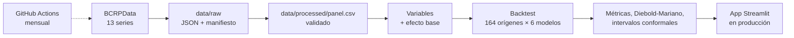

# Fase 0 — Definición del proyecto

> Estado: **cerrada** (2026-09-23). Las fuentes se verificaron contra la API de BCRPData en esa
> fecha.

## 1. El problema

La inflación de Lima Metropolitana pasó de 1,11 % en agosto de 2025 a **4,44 % en agosto de
2026**, por encima del rango meta del BCRP (1 %–3 %). El salto vino de un solo mes: en marzo de
2026 el IPC subió **2,38 %**, la mayor variación mensual desde 2003 y el triple del promedio de un
marzo normal (0,78 %).

Quien fija precios, indexa contratos o arma un presupuesto necesita saber qué inflación esperar
en los próximos 12 meses, y cuánto confiar en esa cifra.

**Pregunta central.** ¿Qué inflación de 12 meses cabe esperar entre septiembre de 2026 y agosto
de 2027, cuándo volvería al rango meta y con qué probabilidad? ¿Un modelo estadístico lo pronostica
mejor que las referencias simples y que la encuesta de expectativas del propio BCRP?

**Usuario.** Un analista de estudios económicos o de finanzas corporativas que necesita un
escenario de inflación con su incertidumbre, no solo un número.

### Preguntas

| # | Pregunta | Dónde se responde |
|---|---|---|
| P1 | ¿Dónde está la inflación hoy y qué componentes la empujan? | App: *Inflación hoy* |
| P2 | ¿Qué inflación de 12 meses se espera mes a mes hasta agosto de 2027, con qué intervalo? | App: *Pronóstico* |
| P3 | ¿Cuándo vuelve al rango meta y con qué probabilidad? | App: *Pronóstico* |
| P4 | ¿Los modelos le ganan al pronóstico ingenuo, a la estacionalidad histórica y a la encuesta? ¿En qué horizontes y etapas? | App: *Validación* |
| P5 | ¿Qué variables mueven el pronóstico actual? | App: *Qué lo mueve* |

## 2. Cómo se mide el éxito

| Métrica | Qué responde |
|---|---|
| **MAE por horizonte** (pp) | Error absoluto medio de la inflación de 12 meses pronosticada a 1–12 meses |
| **MAE relativo al ingenuo** | Menor que 1: el modelo mejora a "la inflación se queda donde está" |
| **Prueba de Diebold-Mariano** | Si esa mejora es estadísticamente significativa o puede ser azar |
| **Cobertura de intervalos** | Si el intervalo de 80 % contiene el dato real el 80 % de las veces |
| **Probabilidad en rango meta** | Cuánta de la distribución pronosticada cae entre 1 % y 3 % |

Todo se mide con **backtesting de origen móvil**: cada pronóstico histórico se hace con los datos
que existían en su fecha, sin mirar el futuro.

## 3. Alcance

**Incluido**
- IPC de Lima Metropolitana, el índice que usa el BCRP para su meta, y sus componentes
  publicados (sin alimentos y energía, transables, no transables).
- Frecuencia mensual, de enero de 2003 a agosto de 2026 (284 meses).
- Horizonte de 1 a 12 meses.

**Fuera de alcance**
- *Efectos causales de la política monetaria.* Los modelos pronostican; no estiman qué pasaría
  si el BCRP moviera la tasa.
- *Pronóstico por rubro* (alimentos, educación, transporte). La API ofrece el IPC por grandes
  agregados, no el detalle de la canasta.
- *IPC nacional.* La meta del BCRP se define sobre Lima Metropolitana.

## 4. Fuentes

BCRPData expone una API pública en JSON, sin clave:
`https://estadisticas.bcrp.gob.pe/estadisticas/series/api/{serie}/json/{inicio}/{fin}`

| Serie | Qué es | Uso |
|---|---|---|
| PN38705PM | IPC Lima, índice dic-2021 = 100 | Validación |
| PN01271PM / PN01273PM | IPC, variación mensual / 12 meses | Variable objetivo |
| PN01276PM / PN01277PM | IPC sin alimentos y energía, mensual / 12 meses | Inflación de fondo |
| PN01281PM / PN01283PM | IPC transables / no transables, 12 meses | Composición |
| PN01287PM | Precios al por mayor, 12 meses | Presiones de costos |
| PD12912AM | Expectativa de inflación a 12 meses (encuesta del BCRP) | Variable y referencia a vencer |
| PD04722MM | Tasa de referencia | Política monetaria |
| PN01210PM | Tipo de cambio bancario promedio | Traspaso cambiario |
| PN01660XM / PN01661XM | Petróleo WTI / trigo, promedio del mes | Precios internacionales |

Las 13 series tienen 284 meses (ene-2003 a ago-2026), salvo la tasa de referencia, que empieza en
septiembre de 2003, cuando el BCRP la creó.

**Rango meta.** 2,5 % ± 1 pp hasta diciembre de 2006 y 2 % ± 1 pp desde enero de 2007
([BCRP, *Moneda* n.º 169](https://www.bcrp.gob.pe/docs/Publicaciones/Revista-Moneda/moneda-169/moneda-169-03.pdf)).
De los 236 meses desde 2007, la inflación estuvo dentro del rango en 102, por encima en 119 y por
debajo en 15.

## 5. Arquitectura

## 6. Plan de fases

| Fase | Entregable | Documento |
|---|---|---|
| 0. Definición | Pregunta, métricas, alcance y fuentes | este archivo |
| 1. Adquisición | `src/extract.py` + manifiesto | [01_adquisicion.md](01_adquisicion.md) |
| 2. Calidad | 8 reglas de calidad sobre el panel | [02_calidad.md](02_calidad.md) |
| 3. Variables | Descomposición de la inflación y variables del modelo | [03_variables.md](03_variables.md) |
| 4. Modelos | 3 referencias y 4 modelos | [04_modelos.md](04_modelos.md) |
| 5. Evaluación | Backtest, Diebold-Mariano, intervalos y pronóstico vigente | [05_evaluacion.md](05_evaluacion.md) |
| 6. App | Streamlit en producción | [06_app.md](06_app.md) |
| 7. Hallazgos | Conclusiones y limitaciones | README |
| 8. Automatización | Pruebas en CI y actualización mensual | [08_automatizacion.md](08_automatizacion.md) |
