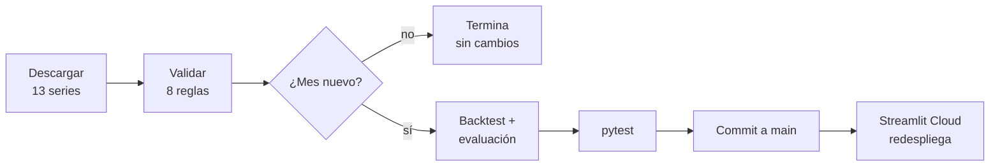

# Fase 8 — Automatización

> Estado: **cerrada** (2026-09-23).

## Pruebas en cada cambio — [`ci.yml`](../.github/workflows/ci.yml)

En cada push y pull request:

1. `python -m src.dataset`: las 8 reglas de calidad sobre los datos versionados.
2. `pytest`: pruebas del pipeline, de los resultados y de la app.

| Prueba | Qué protege |
|---|---|
| `test_quality_rules_pass_on_raw_data` | Los datos crudos cumplen las 8 reglas |
| `test_known_plus_future_rebuilds_12m_inflation` | La identidad del efecto base, en 4 horizontes |
| `test_no_look_ahead` | Que ningún modelo use datos posteriores al origen (ingenuo, estacional, Ridge, SARIMA) |
| `test_forecasts_are_reasonable` | Pronósticos finitos y en un rango plausible |
| `test_diebold_mariano_*` | La prueba estadística: antisimétrica y significativa ante un modelo claramente mejor |
| `test_intervals_are_nested_and_probabilities_valid` | 2,5 % ≤ 10 % ≤ 90 % ≤ 97,5 % y probabilidades entre 0 y 1 |
| `test_conformal_intervals_only_use_past_errors` | Ningún intervalo histórico usa errores que aún no se conocían |
| `test_every_page_renders_without_errors` | Las 5 páginas de la app cargan sin excepciones |

## Actualización mensual — [`actualizar.yml`](../.github/workflows/actualizar.yml)

El día 10 de cada mes, o a pedido desde la pestaña *Actions*:

- **Sin mes nuevo no se reentrena.** Si el panel no cambió, el flujo termina sin commit.
- **Cualquier falla detiene la publicación.** Una regla de calidad incumplida o una prueba que
  falla cortan el flujo antes del commit, y la app sigue mostrando el último pronóstico válido.
- **La app se actualiza sola.** Streamlit Community Cloud redespliega al detectar el commit en
  `main`.
- **El README no se reescribe.** Sus cifras están fechadas al corte de agosto de 2026; la app
  muestra siempre el último dato.
